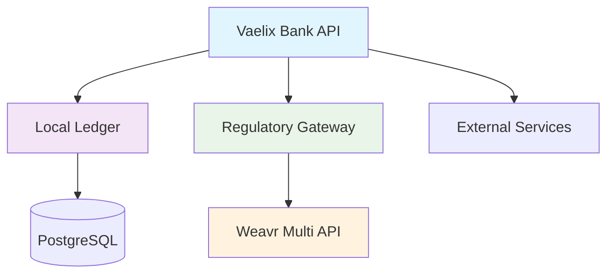

# Vaelix Bank API

[](https://github.com/vaelixbank/vaelix-api/actions/workflows/ci.yml)
[](https://opensource.org/licenses/Apache-2.0)
[](https://nodejs.org/)
[](https://www.typescriptlang.org/)
[](https://www.postgresql.org/)
[](https://www.openbanking.org.uk/)
[](SECURITY.md)
[](https://codecov.io/gh/vaelixbank/vaelix-api)

> A production-ready, open-source banking API built on top of Weavr's Multi API, providing managed accounts and cards functionality with enterprise-grade security.

## 📋 Table of Contents

- [🚀 Features](#-features)
- [🏗️ Architecture](#️-architecture)
- [📦 Installation](#-installation)
- [🗄️ Database Setup](#️-database-setup)
- [⚡ Quick Start](#-quick-start)
- [📚 Documentation](#-documentation)
- [🔧 API Endpoints](#-api-endpoints)
- [🔐 Security](#-security)
- [🤝 Contributing](#-contributing)
- [📄 License](#-license)
- [🙏 Acknowledgments](#-acknowledgments)

## 🚀 Features

### Core Banking Features
- ✅ **User Management**: Corporate & Consumer identity management with KYC/KYB
- ✅ **Authentication**: Strong Customer Authentication (SCA) with OTP & Push Notifications
- ✅ **Account Management**: Managed accounts with virtual IBAN assignment
- ✅ **Card Services**: Virtual & physical card management with CVC retrieval
- ✅ **Transaction Processing**: Sends, transfers, and wire transfers
- ✅ **Beneficiary Management**: Secure beneficiary management with SCA
- ✅ **Bulk Operations**: Enterprise-grade bulk processing capabilities

### Security & Compliance
- 🔒 **AES256-GCM Encryption**: Sensitive data encrypted at rest
- 🛡️ **Rate Limiting**: Multi-tier rate limiting for different endpoints
- 🚫 **Brute Force Protection**: Progressive delays and account locking
- 📊 **Audit Trails**: Complete transaction history and compliance logs
- 🔍 **Regulatory Compliance**: PSD2/Open Banking compliant architecture
- 🔐 **API Key Management**: Encrypted API keys with multiple types

### Developer Experience
- 📖 **OpenAPI Documentation**: Comprehensive API documentation
- 🧪 **TypeScript**: Full type safety and IntelliSense support
- 🐳 **Docker Support**: Containerized deployment ready
- 📊 **Monitoring**: Built-in health checks and metrics
- 🔄 **Webhook Integration**: Real-time event notifications
- 🤖 **CI/CD Pipeline**: Automated testing and deployment
- 🎯 **Code Quality**: ESLint, Prettier, and Husky pre-commit hooks
- 📈 **Test Coverage**: Jest with coverage reporting

## 🏗️ Architecture

Vaelix Bank uses a **"Ledger First"** architecture where the local ledger is the single source of truth for all banking operations. Weavr acts as a regulated intermediary for compliance-required operations only.



### Key Principles

1. **Data Sovereignty**: All business data remains in your infrastructure
2. **Regulatory Compliance**: Weavr provides licensed banking infrastructure
3. **Security First**: AES256 encryption and comprehensive audit trails
4. **Open Banking**: Berlin Group API standards compliant

## 📦 Installation

### Prerequisites

- **Node.js** >= 18.0.0
- **PostgreSQL** >= 13.0
- **npm** or **yarn** package manager

### Clone and Install

```bash
# Clone the repository
git clone https://github.com/vaelixbank/vaelix-api.git
cd vaelix-api

# Install dependencies
npm install

# Copy environment configuration
cp .env.example .env
```

### Environment Configuration

Configure your `.env` file with the required environment variables:

```env
# Server Configuration
PORT=3000
NODE_ENV=development

# Database Configuration
DB_HOST=localhost
DB_NAME=vaelixbank
DB_USER=vaelixbank_user
DB_PASSWORD=your_secure_password
DB_PORT=5432

# Weavr API Configuration
WEAVR_API_BASE_URL=https://sandbox.weavr.io
WEAVR_API_KEY=your_weavr_api_key

# JWT Configuration
JWT_SECRET=your-super-secret-jwt-key
JWT_REFRESH_SECRET=your-refresh-secret-key
JWT_ACCESS_EXPIRY=15m
JWT_REFRESH_EXPIRY=7d

# Encryption Configuration
ENCRYPTION_KEY=your-64-character-hex-key
```

## 🗄️ Database Setup

### 1. Create PostgreSQL Database

```bash
# Create database and user (run as postgres superuser)
sudo -u postgres psql

# In PostgreSQL shell:
CREATE DATABASE vaelixbank;
CREATE USER vaelixbank_user WITH ENCRYPTED PASSWORD 'your_secure_password';
GRANT ALL PRIVILEGES ON DATABASE vaelixbank TO vaelixbank_user;
\q
```

### 2. Inject Database Schema

**Option A: Automatic Injection (Recommended)**

```bash
# Configure your .env file with database credentials first
# Then inject the complete schema automatically
npm run db:schema
```

**Option B: Manual Injection**

```bash
# Using psql directly
psql -h localhost -U vaelixbank_user -d vaelixbank -f data/schema-pgsql.sql

# Or using environment variables
psql -h $DB_HOST -U $DB_USER -d $DB_NAME -f data/schema-pgsql.sql
```

### 3. Verify Schema Installation

```bash
# Check table count (should show 73 tables)
psql -h $DB_HOST -U $DB_USER -d $DB_NAME -c "SELECT COUNT(*) FROM information_schema.tables WHERE table_schema = 'public';"

# List all created tables
psql -h $DB_HOST -U $DB_USER -d $DB_NAME -c "SELECT table_name FROM information_schema.tables WHERE table_schema = 'public' ORDER BY table_name;"
```

### Schema Contents

The database schema includes **73 tables** covering:

- **🏦 Core Banking**: Users, accounts, transactions, cards
- **🔓 Open Banking**: Berlin Group API compliance (consents, payments, webhooks)
- **🏢 BaaS**: Banking as a Service (customers, accounts, cards, transactions)
- **⚖️ Legal Compliance**: KYC, AML, GDPR, regulatory reporting, audit trails
- **🔗 Weavr Integration**: Synchronization tables and Weavr-specific fields

For detailed schema documentation, see [`DATABASE_SETUP.md`](/docs/DATABASE_SETUP.md).

### Docker Setup

```bash
# Build and run with Docker Compose
docker-compose up -d

# Or use Podman
docker-compose -f docker-compose-podman.yml up -d
```

## ⚡ Quick Start

### 1. Create an API Key

```bash
curl -X POST http://localhost:3000/api/keys \
  -H "Content-Type: application/json" \
  -d '{
    "user_id": 1,
    "type": "server",
    "name": "my-server-key"
  }'
```

### 2. Create a Consumer

```bash
curl -X POST http://localhost:3000/api/consumers \
  -H "x-api-key: your-api-key" \
  -H "Content-Type: application/json" \
  -d '{
    "root_user": {
      "name": "John Doe",
      "email": "john@example.com"
    }
  }'
```

### 3. Create a Managed Account

```bash
curl -X POST http://localhost:3000/api/accounts \
  -H "x-api-key: your-api-key" \
  -H "Content-Type: application/json" \
  -d '{
    "profile_id": "profile_123",
    "friendlyName": "Main Account"
  }'
```

### 4. Retrieve IBAN

```bash
curl -X GET http://localhost:3000/api/accounts/123/iban \
  -H "x-api-key: your-api-key"
```

## 📚 Documentation

### 📖 API Documentation
- **[Complete API Reference](docs/API.md)** - All endpoints with examples
- **[Models Documentation](docs/Models.md)** - Data structures and schemas
- **[Controllers Guide](docs/Controllers.md)** - Implementation details
- **[Docker Setup Guide](docs/DOCKER_README.md)** - Complete Docker documentation
- **[Changelog](CHANGELOG.md)** - Version history and release notes

### 🔧 Technical Documentation
- **[Services Architecture](docs/Services.md)** - Service layer overview
- **[Mobile Integration](docs/MOBILE_INTEGRATION.md)** - Mobile app integration
- **[API Keys Guide](docs/API_KEYS_README.md)** - API key management

### 🔒 Security Documentation
- **[Security Policy](SECURITY.md)** - Security guidelines and reporting
- **[Code of Conduct](CODE_OF_CONDUCT.md)** - Community standards

## 🔧 API Endpoints

### Authentication & Users
- `POST /api/auth/login` - User authentication
- `POST /api/consumers` - Create consumer profile
- `POST /api/corporates` - Create corporate profile
- `GET /api/users/:id` - Get user details

### Accounts & Cards
- `POST /api/accounts` - Create managed account
- `GET /api/accounts/:id/iban` - Retrieve IBAN
- `POST /api/cards` - Create managed card
- `GET /api/cards/:id` - Get card details

### Transactions
- `POST /api/transactions/sends` - Send money
- `POST /api/transactions/transfers` - Transfer between accounts
- `GET /api/transactions` - List transactions

### Regulatory Compliance
- `POST /api/regulatory/transactions` - Process regulated transactions
- `GET /api/regulatory/accounts/:id/iban` - Get compliance IBAN

### Strong Customer Authentication (SCA)
- `POST /api/sca/challenges/stepup/otp` - OTP authentication
- `POST /api/sca/challenges/stepup/push` - Push notification auth

## 🔐 Security

### Encryption & Data Protection
- **AES256-GCM** encryption for sensitive data at rest
- **TLS 1.3** encryption in transit
- **bcrypt** password hashing with salt rounds
- **JWT** tokens with configurable expiration

### Access Control
- **Multi-tier API keys**: client, server, and database types
- **Role-based access control** (RBAC)
- **Rate limiting** with progressive delays
- **Brute force protection** with account locking

### Compliance & Audit
- **Complete audit trails** for all operations
- **GDPR compliant** data handling
- **PSD2/Open Banking** regulatory compliance
- **PCI DSS** card data handling standards

### Security Features
```typescript
// Example: Encrypted API key storage
const encryptedKey = encrypt(apiKey.secret); // AES256-GCM
await db.query('INSERT INTO api_keys (secret) VALUES ($1)', [encryptedKey]);
```

## 🤝 Contributing

We welcome contributions from the community! Please see our [Contributing Guide](CONTRIBUTING.md) for details.

### Development Setup

```bash
# Fork and clone the repository
git clone https://github.com/vaelixbank/vaelix-api.git
cd vaelix-api

# Install dependencies
npm install

# Set up pre-commit hooks
npm run prepare

# Copy environment configuration
cp .env.example .env

# Run linting and type checking
npm run lint
npm run typecheck

# Run tests with coverage
npm run test:coverage

# Start development server
npm run dev
```

### Available Commands

```bash
# Development
npm run dev              # Start development server
npm run build            # Build for production
npm run clean            # Clean build artifacts

# Code Quality
npm run lint             # Run ESLint
npm run lint:fix         # Fix linting issues
npm run format           # Format code with Prettier
npm run typecheck        # TypeScript type checking

# Testing
npm test                 # Run tests
npm run test:watch       # Run tests in watch mode
npm run test:coverage    # Run tests with coverage
npm run test:integration # Run integration tests

# Docker
npm run docker:build     # Build Docker image
npm run docker:run       # Run Docker container

# Database
npm run migrate          # Run database migrations
```

### Code Quality

- **ESLint** for code linting with TypeScript support
- **Prettier** for code formatting
- **Husky** pre-commit hooks for quality gates
- **TypeScript** strict mode enabled
- **EditorConfig** for consistent editor settings
- **Jest** for unit and integration testing
- **Codecov** for test coverage reporting

### Testing

```bash
# Run unit tests
npm test

# Run integration tests
npm run test:integration

# Generate coverage report
npm run test:coverage
```

## 🚀 Deployment

### Production Deployment

This API is configured to run under `https://api.vaelixbank.com/`. Make sure to:

1. Set up a reverse proxy (nginx) to forward requests to the API
2. Configure SSL certificates for HTTPS
3. Set environment variables appropriately
4. Use a process manager like PM2 in production

### Environment Variables

```bash
# Server Configuration
PORT=3000
NODE_ENV=production

# Database Configuration
DB_HOST=your_db_host
DB_NAME=your_db_name
DB_USER=your_db_user
DB_PASSWORD=your_db_password
DB_PORT=5432

# Weavr API Configuration
WEAVR_API_BASE_URL=https://api.weavr.io
WEAVR_API_KEY=your_weavr_api_key

# Security Configuration
ENCRYPTION_KEY=your_64_char_hex_encryption_key
JWT_SECRET=your_jwt_secret
JWT_REFRESH_SECRET=your_refresh_secret

# Email Configuration (optional)
SMTP_HOST=your_smtp_host
SMTP_PORT=587
SMTP_USER=your_smtp_user
SMTP_PASS=your_smtp_password
```

### Docker Deployment

```bash
# Quick development setup
make dev

# Production deployment
make prod

# With monitoring stack
make monitoring
```

#### Available Environments

- **Development**: `docker-compose.dev.yml` - Hot reload, debugging, dev tools
- **Production**: `docker-compose.prod.yml` - Optimized, secure, scalable
- **Override**: `docker-compose.override.yml` - Local customizations

See **[Docker Documentation](docs/DOCKER_README.md)** for complete setup instructions.

### Cloud Deployment

The API is designed to work with:
- **AWS**: ECS, EKS, or Lambda
- **Google Cloud**: Cloud Run or GKE
- **Azure**: Container Instances or AKS
- **Heroku**: Standard deployment
- **DigitalOcean**: App Platform or Droplets

## 📄 License

This project is licensed under the **Apache License 2.0** - see the [LICENSE](LICENSE) file for details.

```
Copyright 2024 Vaelix Bank

Licensed under the Apache License, Version 2.0 (the "License");
you may not use this file except in compliance with the License.
You may obtain a copy of the License at

    http://www.apache.org/licenses/LICENSE-2.0

Unless required by applicable law or agreed to in writing, software
distributed under the License is distributed on an "AS IS" BASIS,
WITHOUT WARRANTIES OR CONDITIONS OF ANY KIND, either express or implied.
See the License for the specific language governing permissions and
limitations under the License.
```

## 🙏 Acknowledgments

- **Weavr** for providing the regulated banking infrastructure
- **Open Banking Initiative** for the standards and specifications
- **The Open Source Community** for the amazing tools and libraries

### Built With

- [Node.js](https://nodejs.org/) - Runtime environment
- [TypeScript](https://www.typescriptlang.org/) - Type-safe JavaScript
- [Express.js](https://expressjs.com/) - Web framework
- [PostgreSQL](https://www.postgresql.org/) - Database
- [Weavr Multi API](https://weavr.io/) - Banking infrastructure

---

<div align="center">

**Vaelix Bank API** - Empowering Open Banking Innovation

[](https://github.com/vaelixbank/vaelix-api)
[](https://github.com/vaelixbank/vaelix-api)
[](https://github.com/vaelixbank/vaelix-api/issues)

[📖 Documentation](docs/) • [🐛 Report Bug](https://github.com/vaelixbank/vaelix-api/issues) • [💡 Request Feature](https://github.com/vaelixbank/vaelix-api/issues)

</div>
